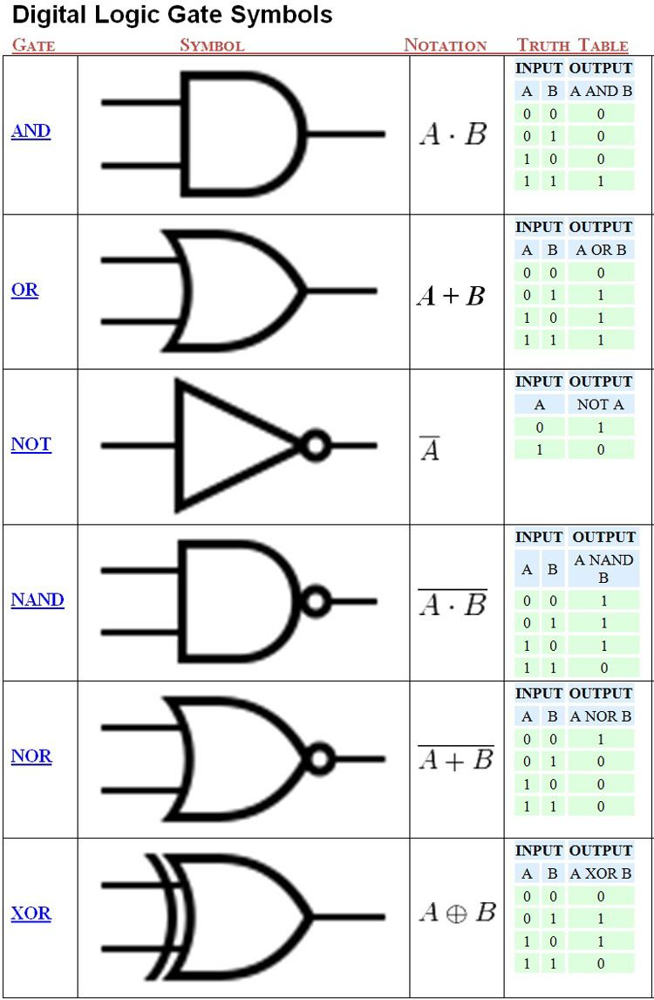

# Laws of Boolean Logic/Set Algebra
* Commutative
* Associative
* Distributive
* Idempotent Laws
* Domination Laws
* Absorption Laws
* Identity Property
* Complement Laws for Universal and Empty Sets
* Involution Law
* An Unnamed Law
* Demorgan's Laws


<br><br><br><br><br><br><br><br><br>

---------------------------------------------------------------
# Equating Set Algebra Laws with Boolean Logic
* Consider the concept of `True` as being a logical descriptor for a set $A$ containing $n$ elements.
* In this sense, all the above laws will apply to both Sets and Boolean operations


| Set Operator     | Python Boolean Operator |
|------------------|------------------|
|  <center> Union </center> | <center> `or` </center> |
|  <center> Intersection </center> | <center> `and` </center> |
|  <center> Complement </center> | <center> `not` </center> |


<br><br><br><br><br><br><br><br><br>

---------------------------------------------------------------
# Commutative
* A ∪ B = B ∪ A
* AB = BA

Set Logic

```python
set1 = {'a', 'b', 'c'}
set2 = {'c', 'd', 'e'}

print(set1.union(set2) == set2.union(set1)) # --> True
print(set1.intersection(set2) == set2.intersection(set1)) # --> True
```

Boolean Logic

```python
a = True
b = False

print( (a or b) == (b or a) ) # --> True
print( (a and b) == (b and a) ) # --> True
```

<br><br><br><br><br><br><br><br><br>

---------------------------------------------------------------
# Associative
* (A ∪ B) ∪ C = A ∪ (B ∪ C) = A ∪ B ∪ C
* (AB)C = A(BC) = ABC

Set Logic

```python
set1 = {'a', 'b', 'c'}
set2 = {'c', 'd', 'e'}
set3 = {'a', 'e', 'f'}

print((set1.union(set2)).union(set3) == (set3.union(set2)).union(set1)) # --> True
print((set1.intersection(set2)).intersection(set3) == (set3.intersection(set2)).intersection(set1)) # --> True
```

Boolean Logic

```python
a = True
b = False
c = True

print( ((a or b) or c) == (a or (b or c)) ) # --> True
print( ((a and b) and c) == (a and (b and c)) ) # --> True
```


<br><br><br><br><br><br><br><br><br>

---------------------------------------------------------------
# Distributive
* A ∪ (BC) = (A ∪ B)(A ∪ C) 
* A(B ∪ C) = (AB) ∪ (AC)


Set Logic

```python
set1 = {'a', 'b', 'c'}
set2 = {'c', 'd', 'e'}
set3 = {'a', 'e', 'f'}

print( (set2.intersection(set3)).union(set1) == (set1.union(set2)).intersection((set1.union(set3))) ) # --> True
print( (set2.union(set3)).intersection(set1) == (set1.intersection(set2)).union((set1.intersection(set3))) ) # --> True
```

Boolean Logic

```python
a = True
b = False
c = True

print( (a or (b and c)) == ((a or b) and (a or c)) ) # --> True
print( (a and (b or c)) == ((a and b) or (a and c)) ) # --> True
```


<br><br><br><br><br><br><br><br><br>

---------------------------------------------------------------
# Idempotent Laws
* _when redundant operations achieve the same result_
* A ∪ A = A
* AA = A


Set Logic

```python
set1 = {'a', 'b', 'c'}

print( set1.union(set1) == set1 ) # --> True
print( set1.union(set1) == set1 ) # --> True
```

Boolean Logic

```python
a = True

print( (a or a) == a ) # --> True
print( (a and a) == a ) # --> True
```


<br><br><br><br><br><br><br><br><br>

---------------------------------------------------------------
# Domination Laws
* Recall:
    * U = Universal Set, he set which contains all subsets
    * ∅  = Empty Set = { }
* A ∩ U = A
* A ∩ ∅ = ∅


<br><br><br><br><br><br><br><br><br>

---------------------------------------------------------------
# Absorption Laws
* A ∪ (AB) = A
* A(A ∪ B) = A

Set Logic

```python
set1 = {'a', 'b', 'c'}
set2 = {'c', 'd', 'e'}

print( set1.intersection(set2).union(set1) == set1 ) # --> True
print( set1.intersection(set1.union(set2)) == set1) # --> True
```

Boolean Logic

```python
a = True
b = False
c = True

print( (a or (a and b)) == a) # --> True
print( (a and (a or b)) == a) # --> True
```


<br><br><br><br><br><br><br><br><br>

---------------------------------------------------------------
# Identity Property
* A ∪ ∅ = A

<br><br><br><br><br><br><br><br><br>

---------------------------------------------------------------
# Complement Laws for Universal and Empty Set
* ~∅ = U
* ~U = ∅


<br><br><br><br><br><br><br><br><br>

---------------------------------------------------------------
# Involution Law
* ~( ~A) = A

```python
a = True
print( (not (not a)) == a) # --> True

```


<br><br><br><br><br><br><br><br><br>

---------------------------------------------------------------
# A helpful, unnamed law
* AB ∪ A~B = A


```python
a = True
b = False

print( ((a and b) or (a and not b)) == a) # --> True

```

<br><br><br><br><br><br><br><br><br>

---------------------------------------------------------------
# DeMorgan’s Laws
* 1st: ~(A ∪ B) = ~A ~B
* 2nd: ~(AB) = ~A ∪ ~B

These laws are very helpful for logic and circuit reduction. They are commonly explored in interview questions


### ~(A ∪ B) = ~A ~B

```python
a = True
b = False

print( (not (a or b)) == ((not a) and (not b)) ) # --> True

```


### ~(AB) = ~A ∪ ~B

```python
a = True
b = False

print( (not (a and b)) == (not a or not b) ) # --> True

```


<br><br><br><br><br><br><br><br><br>

---------------------------------------------------------------
# Logic Gates
* Can create diagrams that allow for variable input
* The laws above can be used to simplify circuits

Recall: 
* `not A` == $\overline A$ == ~A


