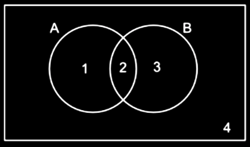

# Conditional Probability and Bayes
* Bayesian vs Frequentist Thought
* Kolmogorov's Definition for Conditional Probability
* Law of Total Probability
* Bayes Theorem
* Bayes Textbook Problems

       

----------------------------------------------------
# Bayesian vs Frequentist Thought
##### Frequentist
Statistical inference in the past century has primarily relied upon a classical, or frequentist approach, which makes inferences about populations from samples. This approach results in some explicit level of confidence via hypothesis testing and confidence intervals, using probability theory and probability distributions as the foundation to determine whether a sampling is difference by chance, or because the population being sampled is actually different than some initial hypothesized value.

##### Bayesian
ayesian Inference does not consist of a static model the way that frequentist statistics do, rather, the models take in new information, and based on that new data, the underlying probabilistic model is adjusted. This is called the posterior distribution, in the end we end up with an evolving model. Essentially, new observations allow for “updating a belief” about the phenomenon being observed.

       

----------------------------------------------------
# Conditional Probability
A conditional probability is a measure of the probability of one event occurring, given that another (different) event has occurred, or will occur.
* Implicitly, we presume, assume, assert, or see evidence that the given event has or will occur.
* This can be interpreted as limiting the sample space of the event we are measuring. 

       

----------------------------------------------------
# Visualizing Conditional Probability

$$
P(A|B) = \frac{P(A \cap B)}{P(B)} = \frac{2}{2+3} = \frac{2}{5} = 0.4
$$

       

----------------------------------------------------
# 

https://docs.google.com/presentation/d/1PHxm_tiTLT30WiL4rhKrjZx2wgY4-BciiWgyYQdVThs/edit#slide=id.gac287a8af4_0_392